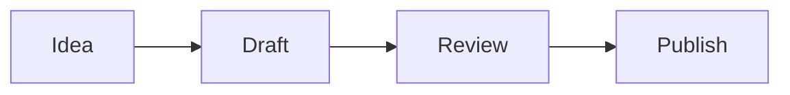

# Files And Media

Bigfoot Note starts with Markdown notes, but a vault can also contain images, PDFs, media files, whiteboards, and other local files.

## Mermaid Diagrams

Use Mermaid code blocks when a note needs a diagram that should stay plain text and versionable.

````md

````

Bigfoot Note renders Mermaid diagrams in the editor while keeping the source in Markdown.

## Attachments

Images pasted into the editor are saved into the vault as normal files. They remain portable and can be opened by other tools.

## Previews

Bigfoot Note can preview common image files, PDFs, and supported media files in the app. Files without an in-app preview can still be opened in the default system app.

Settings control whether PDFs, images, and unsupported files appear in All Notes. Folder browsing still shows files in their folders.

## Whiteboards

Whiteboards use tldraw in the editor, but their durable representation stays in Markdown. That keeps them inside the vault and versioned by Git with the rest of your notes.

## Git Boundary

If generated or local-only files are ignored by Git, Bigfoot Note can hide them from notes, search, quick open, and folders. Use this when build artifacts or private local files should not behave like vault content.
